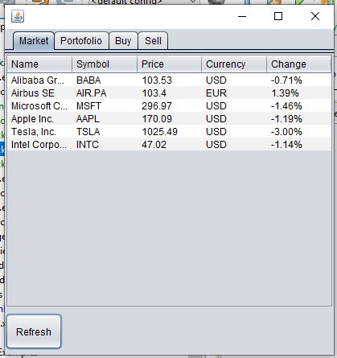
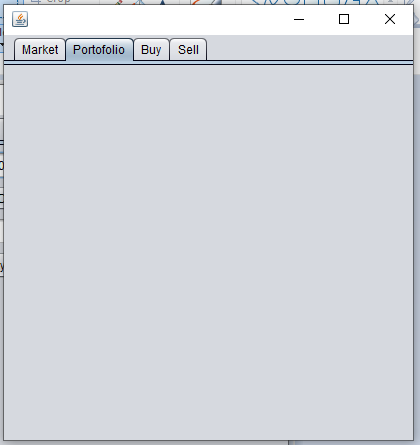
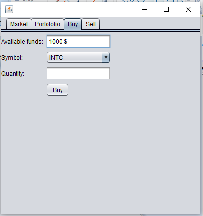
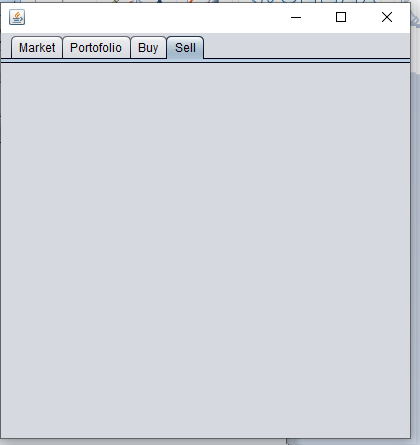

# Lab 9

**Acest laborator este destinat studentilor din Seria B Cluj-Napoca si Satu-Mare si difera de laboratorul 9 corespunzator seriei A!**

## Exercise 1 

Implement a basic stock trade application starting from the example provided in package exercise 1.

The aplication should provide following functionalities:
- View market stocks and their current value - this feature is implemented and can be used as reference for next points;

- View user portofolio owned stocks
    - View owned stocks in a table view similar with Market;
    - For each owned stock display in table followings: symbol, name, quantity, current market value (quantity * price); 

- Buy stock:
    - Implement "Buy" button functionality;
    - Buy is limited by available cache funds (stored in Portofolio class, attribute "funds");

- Sell stock
    - Create user interface similar with Buy interface
    - Symbol dropdown button should display only stocks owned by user;
    - When sell is complete funds will automatically be increased with stock quantity * price;

For implementing user interface use **Netbeans 12.6** and **UI designer** facility. All user interface should be implemented in the provided **StockMarketJFrame** class. 

### Implementation notes

Note 1 - Stock symbols are hardcoded in StockMarketQueryService      private String[] symbols = new String[] {"INTC", "BABA", "TSLA", "AIR.PA", "MSFT", "AAPL"};     
. You can add your own symbol as long as correspond to some real market symbols. 

Note 2 - For understanding how table model is created and how query service is integrated with the user interface view last year course starting with minute 15:00 here -> https://bit.ly/35X9YhN 

## Exercise 2

Create UML Class diagram and insert it bellow.

----- UML CLASS DIAGRAM -------

## Exercise 3 (Optional)

Study MVC design pattern and how this can be implemented in Java. Here are some links presenting how MVC pattern can be implemented:
- https://medium.com/@ssaurel/learn-to-make-a-mvc-application-with-swing-and-java-8-3cd24cf7cb10 
- https://examples.javacodegeeks.com/core-java/java-swing-mvc-example/ 

